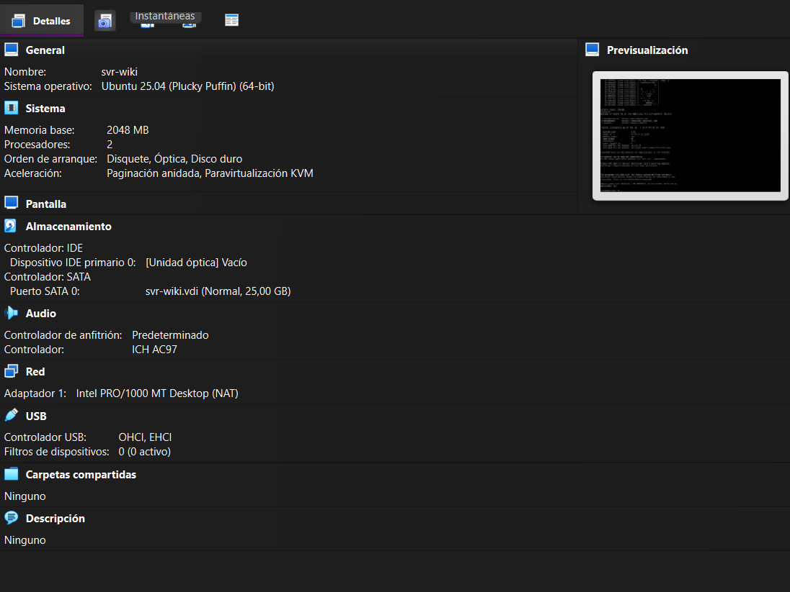
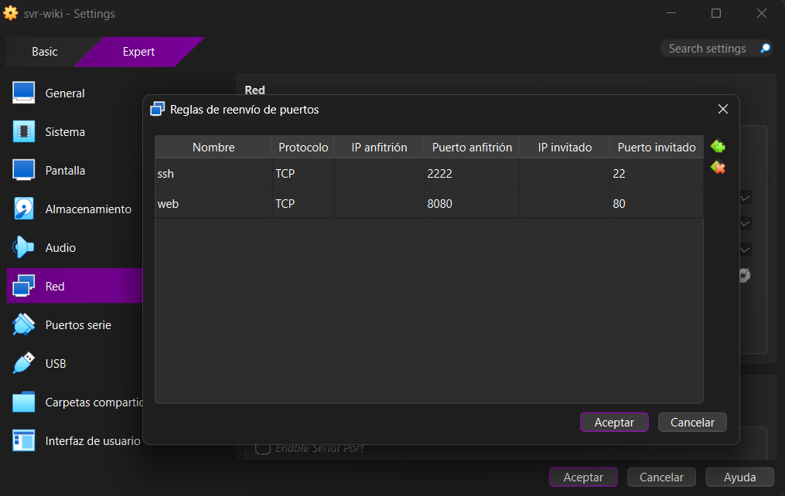

# Bloque B · Instalación y configuración básica

**¿Qué es NAT?**
NAT (Network Address Translation) es un mecanismo que permite a los dispositivos de una red privada (como nuestra VM) salir a Internet enmascarando sus direcciones IP internas detrás de una única dirección IP pública compartida por el router (o el anfitrión, en este caso).

**¿Para qué sirve el reenvío de puertos (Port Forwarding)?**
Como la VM está "oculta" detrás del NAT, desde el exterior no se puede iniciar una conexión hacia ella. El reenvío de puertos soluciona esto mapeando un puerto específico del anfitrión (ej. 8080) y redirigiendo todo su tráfico hacia un puerto específico del servidor invitado (ej. 80), permitiendo el acceso a servicios internos como SSH o HTTP.

**DHCP vs IP Fija:**

- **DHCP:** Protocolo que asigna direcciones IP, máscaras de red y puertas de enlace de forma automática y dinámica cada vez que el equipo se conecta.
- **IP Fija (Estática):** Es una dirección configurada manualmente que nunca cambia. Es **fundamental para servidores** (como Nginx), ya que garantiza que los clientes y servicios DNS siempre encuentren el servidor en la misma ruta lógica, evitando caídas de servicio por caducidad de la concesión DHCP.
