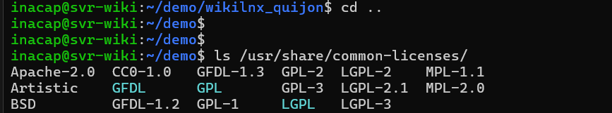
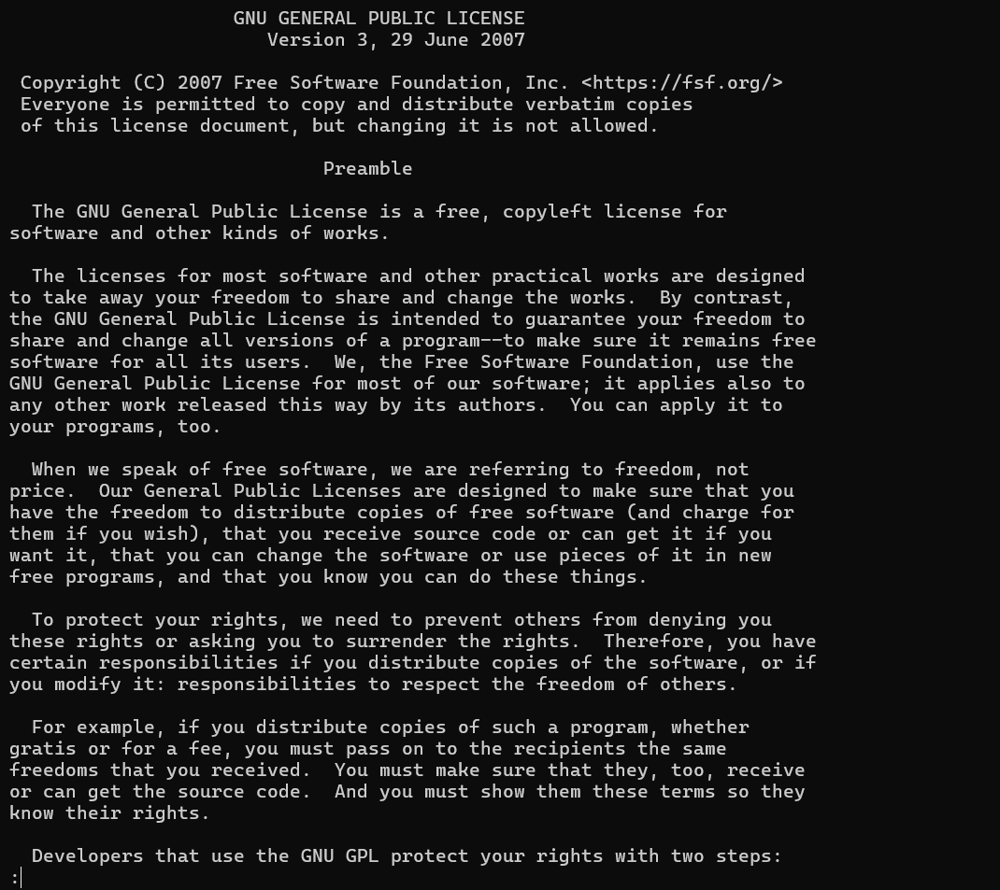

# Software libre y licencias

**¿Qué es el Software Libre?**
Es aquel software que garantiza a los usuarios las cuatro libertades fundamentales: la libertad de ejecutar el programa para cualquier propósito, estudiar cómo funciona y modificarlo, redistribuir copias y distribuir versiones modificadas a terceros. No se refiere necesariamente a precio (gratis), sino a la libertad sobre el código fuente.

**Diferencia entre Copyleft (GPL), Permisivas (MIT/BSD/Apache) y Propietario:**

- **Copyleft (GPL):** Garantiza que cualquier trabajo derivado u obra modificada deba distribuirse obligatoriamente bajo los mismos términos de libertad. Impide que el código se cierre en futuros proyectos.
- **Permisivas (MIT/BSD/Apache):** Otorgan libertades similares para usar y modificar, pero no obligan a que las obras derivadas mantengan la misma licencia. Permiten integrar código libre dentro de software propietario de código cerrado.
- **Propietario:** El código fuente es cerrado, privativo y pertenece exclusivamente a su autor o empresa. Se imponen severas restricciones legales sobre su uso, copia y modificación.

**¿Bajo qué tipo de licencia está Ubuntu?**
Ubuntu es un sistema operativo GNU/Linux, lo que significa que es un agregado de miles de paquetes de software. Su componente central (el kernel de Linux) está bajo licencia copyleft estricta **GPLv2**. Sin embargo, la distribución en sí contiene una mezcla de software bajo licencias GPL, permisivas e incluso algunos controladores propietarios necesarios para el hardware.
